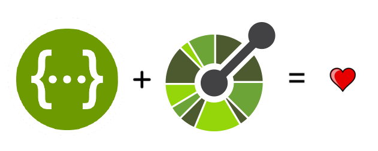
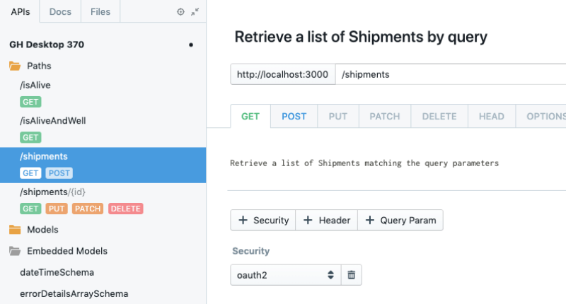
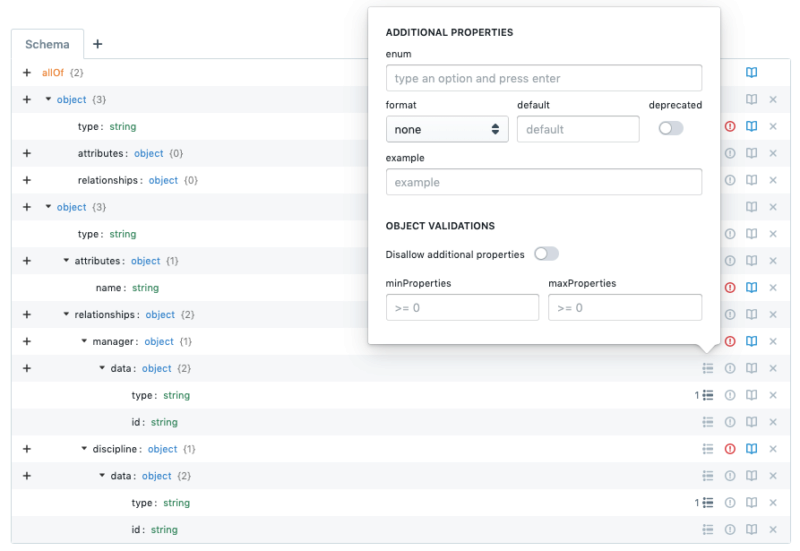
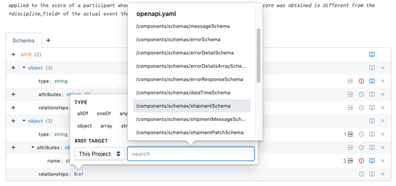
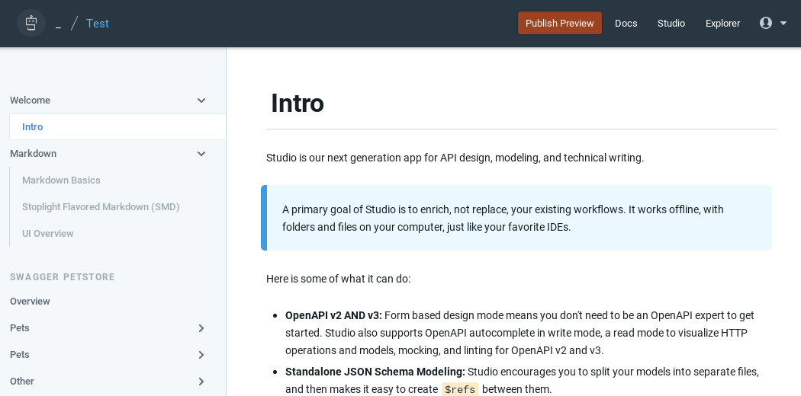
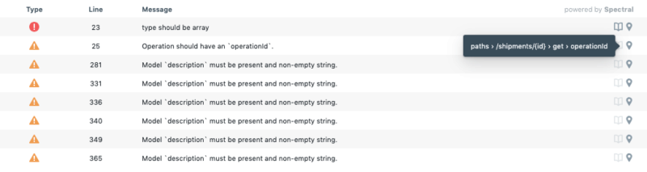
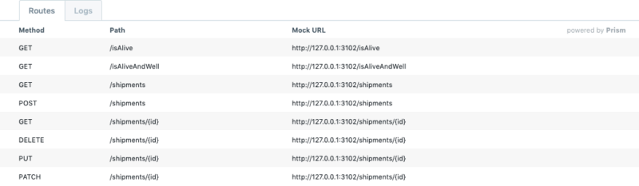

# Stoplight Studio

Studio is Stoplight's next generation application for API design, modeling, and technical writing. A primary goal of Studio is to enrich, not replace, your existing workflows. When running locally it works fully offline, with folders and files on your computer just like your favorite IDE. When running in the browser, the web-native Git support allows you to effortlessly work with your existing repositories safely and efficiently.

## Full Support for OpenAPI v2 and v3

Studio comes with full support for the OpenAPI versions 2 and 3 specification formats for all functionality. That means full validation, mocking, and modeling support for both versions of the OpenAPI specification.

## Graphical API Design

Form-based designing means you don't need to be an OpenAPI expert to get started. Studio has a "write" (code) mode with full OpenAPI autocomplete, and a "read" mode for visualizing HTTP operations and models.

To find out more about how you can quickly design and prototype APIs without writing a single line of JSON or YAML, see [here](/Docs/Design-and-Modeling/01-getting-started.md).

## JSON Schema Modeling

Studio is not just for APIs, you can also create and modify standalone JSON Schema files for storing data models. Did we mention that this is also powered by the graphical interface? No more searching for the matching bracket or the missing space, and no need to be familiar with the in's and out's of JSON Schema.

## Encourage Reuse, Avoid Duplication

When it comes to API modeling, avoiding duplication of effort can be the difference between success and failure. How can you enforce consistency if all of your endpoints re-create the same model in slightly different ways? (hint, you can't)

Studio allows you to quickly and easily find and reuse the objects you need, as you need them. No more recreating models for different endpoints, no more having to update dozens of different endpoints because a new field was added.

To find out more about how you can leverage references to scale your API consistency, see [here](Design-and-Modeling/using-references.md).

## Technical Documentation

Mix API Reference Documentation and Markdown-based guides, how-tos, getting started information, etc. All of your documentation can live together in the same project. Studio includes a built-in Markdown editor, image manager, and the ability to publish documentation to Stoplight’s new documentation platform.

You can even host the files in your own Git repository, and then publish when you're ready to show off your latest and greatest.

To find out more about writing technical documentation in Studio, see our getting started guide [here](https://stoplight.io/p/docs/gh/stoplightio/studio/docs/Documentation/01-getting-started.md).

## Stoplight-Flavored Markdown

Stoplight-flavored Markdown (SMD) is a fully compatible superset of [CommonMark](https://commonmark.org/), the popular Markdown specification. SMD enables a few advanced block types that will enrich your user’s documentation experience, and includes options such as call-outs, tabs, JSON Schema elements, and HTTP "try it out" blocks.

To find out more about the SMD format and how you can use it to improve your documentation, see [here](https://stoplight.io/p/docs/gh/stoplightio/studio/docs/Documentation/03-stoplight-flavored-markdown.md).

## Style Guides and Validation

Enforce correctness and best practices with the native [Spectral](https://stoplight.io/spectral/) integration that alerts you to errors the moment they are created.

Clicking on errors or warnings also brings you to exactly where they are located in the document, making it easy to fix errors at the source.

To find out more about Spectral and how validations can improve your API design workflow, see [here](/Docs/Design-and-Modeling/validation-style-guide.md).

## Built-in Mocking

When running locally, Studio will automatically start a local [Prism mock server](https://stoplight.io/prism/) for every API defined in your project, and keep that mock server up to date as you change your designs.

To find out more about Prism and how mocking can be used to streamline your API development process, see [here](https://stoplight.io/p/docs/gh/stoplightio/studio/docs/Design-and-Modeling/mock-servers.md).

## Bring Your Own Repository

Since Studio works with your local filesystem, you can open up your API projects and start adding docs and designs alongside the actual implementation they are meant to describe. Once you're done, check it all into Git with your favorite Git client!
