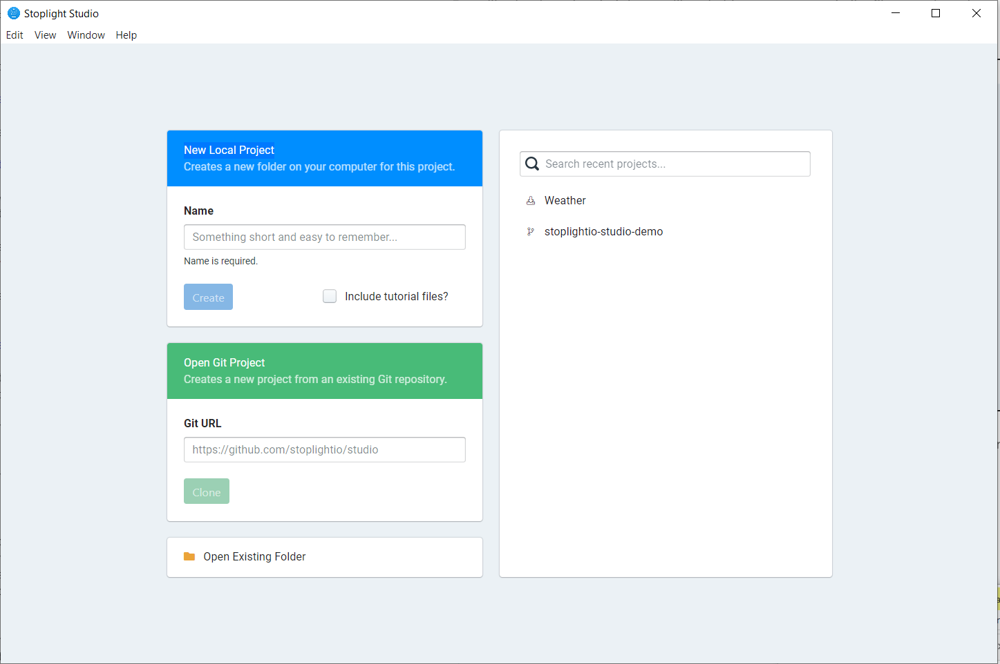
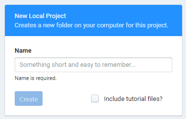
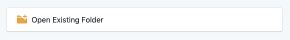
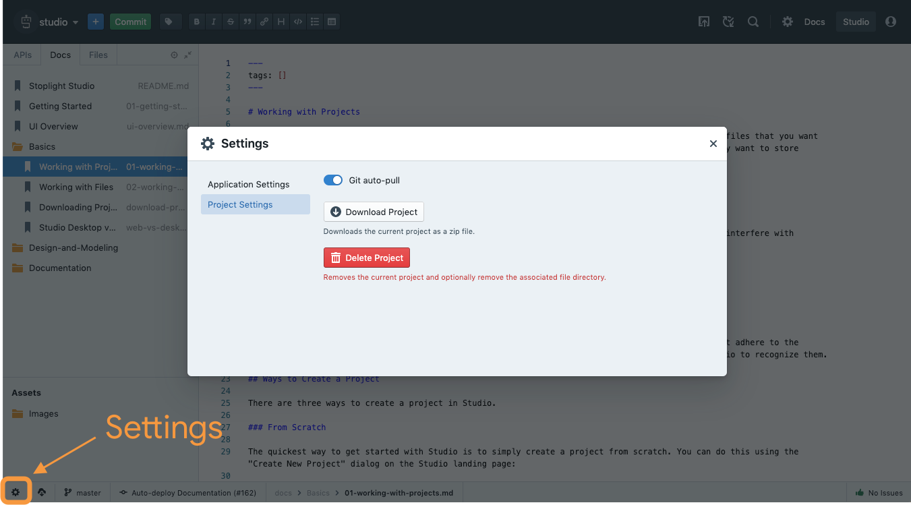

# Working with Projects

Projects in Studio provide a place for you to manage collections of APIs, articles, and any other files that you want to store together. You can have as many projects as you like, but keep in mind that you'll probably want to store similar files together when possible.

## Project Structure

Studio projects assume a specific structure in order to group files efficiently as well as to not interfere with existing files if you are importing an existing repository. The structure is:

- `/docs` - Where articles (markdown files) are stored

- `/reference` - Where API specifications and JSON schema files are stored

- `/assets/images` - Where images are stored

> If you have an existing repository with markdown, image, or API specification files that does not adhere to the format above, you will need to move the files to their corresponding directories in order for Studio to recognize them.

## Ways to Create a Project

There are three ways to create a project in Studio.

### From Scratch

The quickest way to get started with Studio is to simply create a project from scratch. You can do this using the "Create New Project" dialog on the Studio landing page:

> Optionally click the "Include tutorial files" option to have a few sample files added to your new project.

#### Where are "From Scratch" projects stored?

When running from the desktop application, projects created within Studio's "New Local Project" will be created under your default documents folder:

- On macOS, the default folder is `$HOME/Documents/Stoplight Studio`
- On Windows, the default folder is `%HOMEDRIVE%%HOMEPATH%/Documents/Stoplight Studio`
- On Linux, the default folder is `$HOME/Documents/Stoplight Studio`

### From Git

Projects typically map directly to a **Git repository**. Git allows you to easily version files, track changes, and collaborate with others in a distributed manner. Studio offers native Git integration, allowing you to create projects directly from your existing repositories in Github, Bitbucket, GitLab, and any other source control provider that speaks the Git protocol.

To create a project from an existing Git repository, simply enter the repository URL in the "Open Git Project" dialog in the Studio startup screen and click "Clone":

Once the project is retrieved from the provider, you can make changes, create new branches, and push updates.

### From an Existing Folder

> This section only applies to the Studio desktop application

You can also create projects from an existing directory/folder on your computer, no Git or source control required. To do this, simply select the "Open Existing Folder" dialog from the Studio startup screen.

You can then select the folder you would like to use as a project.

## Deleting Projects

To delete a Project, select the Settings Cog in the bottom left corner of the screen. Then select Project Settings from the dropdown, then click **Delete Project**.
