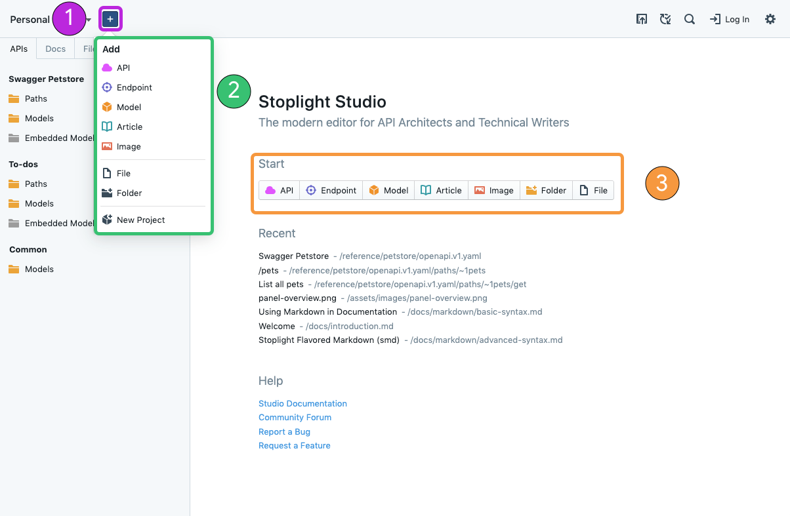

# Working with Files

1. **+**: Create New File
2. **Create New File Menu**
3. **Alternate Create New File Menu**: Only displays when no file is selected

## What

Studio supports 5 key API Design and Documentation files in multiple formats. The general categories for these files are located within the file creation dropdown (**+**). They include:

- **API:** API Description Documents
- **Endpoint:** Individual Paths & Operations
- **Model:** Reusable API Components
- **Article:** Supplemental Markdown Files
- **Image:** Supplemental Images

There are also three other categories of files listed in the file creation dropdown:

- **File:** Generic file creation
- **Folder:** For organizing content in your Git repository and Studio
- **Style Guides:** For customizing the [validation and linting](../Design-and-Modeling/08-validation-style-guide.md)

## How

1. **Create a New Project** or **Open an Existing Project**
2. Click the **+** button

### API

1. Input a **Name** for your API
2. Select **Show Advanced** to select between OpenAPI version and Format
3. Click **Create**

### Endpoint

1. Select an **API** to add the endpoint to
2. Add a **Tag** to group similar endpoints together (Recommended)
3. Input the endpoint’s **Path**
4. Click **Create**

### Model

1. Input a **Name** for your model
2. Add a **Tag** to group similar models together (Recommended)
3. Choose the **Scope** for your model

> Common models are accessible across all APIs within that Project.

4. Select **Show Advanced** to input a Version and select the Format
5. Click **Create**

### Article

1. Input a **Title** for your Markdown file
2. Add a **Tag** to group similar Markdown files together
3. Click **Create**

### Image

1. Select an image file from local disk

### File

1. Input a filename
2. Press Enter

### Folder

1. Input a folder name
2. Press Enter

### New Project

#### New Personal Project

1. Input a **Project Name**
2. Click **Create**

#### Open Git Project

1. Input Git URL
2. Click **Clone**

#### Open Existing Folder

1. Select a folder from local disk
