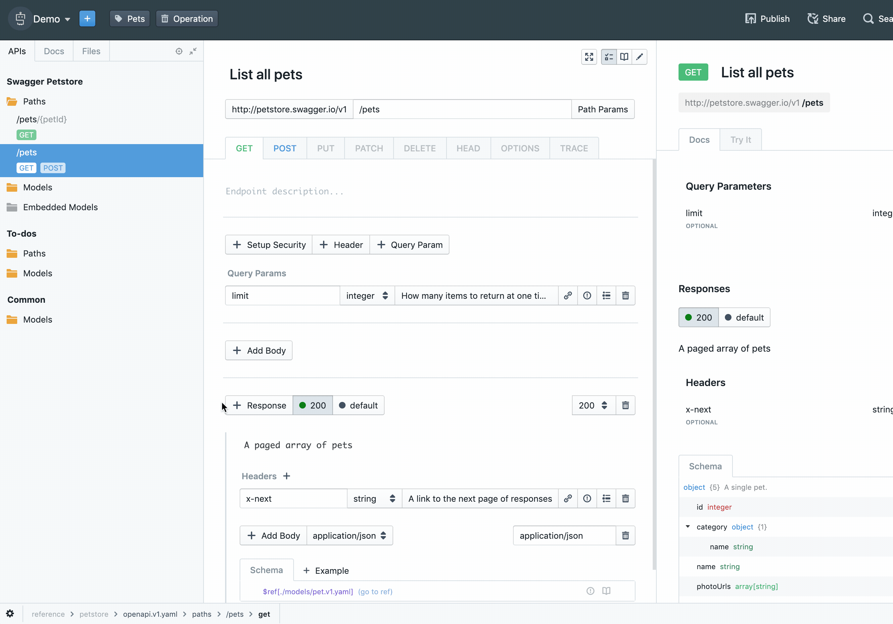

# Deleting Projects

If you no longer need a project to show up in Studio, you can delete it via the settings panel.

To download a project:

1. If you haven't already, select the project from the Studio landing screen
2. Navigate to the settings menu using the cog wheel at the left bottom corner of the screen
3. Select the **Project Settings** option from the menu
4. Click the **Delete Project** button
5. Click **Confirm** and the project will not longer show up in Studio
  - Studio Desktop offers another option: **Confirm and remove files**, which will delete the files from the local filesystem too. Only click it if you mean it! 
