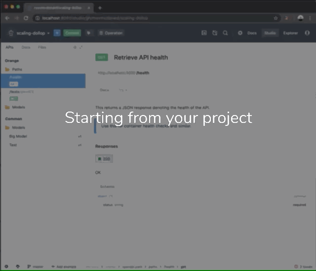

# Downloading Projects

If you ever need to save the contents of your project without pushing to a Git repository,
you can download a zip file of the current project directly from the Studio settings menu.

> Note that this functionality is only available in the **web version** of Studio. If you need the project contents using Studio Desktop look to see where the directory exists in Project Settings.

To download a project:

1. Select the project you would like to download from the Studio landing screen
2. Navigate to the settings menu using the cog wheel at the left bottom corner of the screen
3. Select the **Project Settings** option from the menu
4. Click the **Download Project** button, which will start the download

The download process will handle resolving $ref's in OpenAPI or JSON Schema files, so users of the design library will still see references to the models in the design library. For that, the "Export API" option might be more appropriate.
