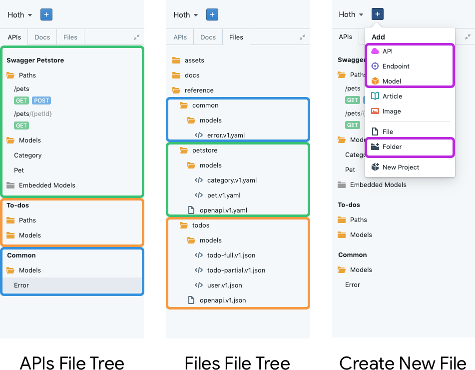

# Project Structure (Design & Modeling) 

## What 

### Files Created Within Studio
Stoplight Studio’s directory structure (aka file tree structure) organizes and displays accessible files in Studio. API specific files (API specifications and models) can be viewed within the **APIs** file tree tab and all files can be viewed within the **Files** tab. 

### Files Uploaded to Studio 
To publish and modify API specifications created outside of Studio, they must be stored within `reference/{API-title}`. Models must be stored within `reference/{API-title}/models` . Common models must be stored within `reference/common`.

## How 

### Files Created Within Studio 
1. [Add an API, Endpoint, or Model via the UI](../workflow/working-with-files.md)
2. The file will be visible within the **APIs** file tree tab 
3. Switch to the **File** file tree (**optional**)
4. Open the **reference** folder to view created API folders 
5. Open the **common** folder to view created Common Models 
6. Open individual API folders to view API Specification files and API specific models folder 

### API Specification Files Uploaded to Studio 
1. [Clone your Git Repository](../workflow/working-with-git.md)
2. Click the **+** button and select **Folder** from the dropdown

> Alternative Solution: Right-click on the file tree and select **New Directory** 

3. Input **reference** for the new folder/directory name 
4. Create another folder (step 2) and input your **APIs name** for the new folder/directory 
5. Nest the **APIs name** folder within the **references** folder via drag drop   
6. Drag drop existing API Specification file into the **APIs name** folder 
7. That API Specification will now be accessible in Studio’s APIs file tree

### Model Files Uploaded to Studio 
1. [Clone your Git Repository](../workflow/working-with-git.md)
2. Click the **+** button and select **Folder** from the dropdown

> Alternative Solution: Right-click on the file tree and select **New Directory** 

3. Input **reference** for the new folder/directory name 
4. Create another folder (step 2) and input your **APIs name** for the new folder/directory 
5. Nest the **APIs name** folder within the **references** folder via drag drop
6. Create another folder and input **models** for the new folder/directory 
7. Nest the **models** folder within the **APIs name** folder 
8. Drag drop existing models into the **models** folder 
9. Those models are now accessible in Studio’s APIs file tree 

### Common Models Uploaded to Studio 
1. [Clone your Git Repository](../workflow/working-with-git.md)
2. Click the **+** button and select **Folder** from the dropdown

> Alternative Solution: Right-click on the file tree and select **New Directory** 

3. Input **reference** for the new folder/directory name 
4. Create another folder (step 2) and input **common** for the new folder/directory 
5. Create another folder (step 2) and input **models** for the new folder/directory
6. Drag drop existing common models into the **common/models** folder 
7. Those common models are now accessible in Studio’s APIs file tree 

