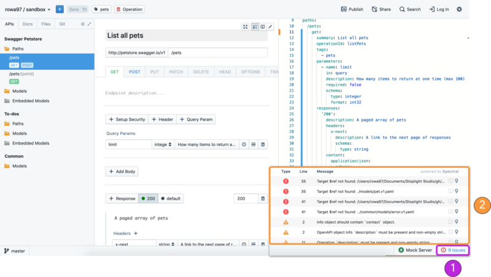

# Validation and Linting

## What

In Stoplight Studio, you can validate and lint your API specifiation during the design process. This provides a practical method for enforcing API design rules over multiple APIs. You can monitor and validate things like your API, operations, markdown, parameters, paths, and references. Spectral, our spec validator, will trigger either a warning (denoted by a yellow exclamation icon) or an error (denoted by a red exclamation icon) if the rules conditions are not met.

### Style Rules

Style rules refer to non-OAS specific rules such as setting requirements around providing descriptions for operations. Style rules are denoted by a blue pencil icon and typically trigger warnings when enabled.

### Validation Rules

Validation rules refer to OAS specific rules that signify whether a specification is technically correct. An example of a validation rule would be requiring a unique `operationID` for every operation. Validation rules are denoted by a green check mark icon and typically trigger errors.

> The Style & Validation rule engine is powered by our open-source project [Spectral](https://github.com/stoplightio/spectral)
