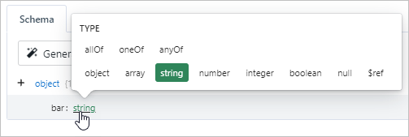
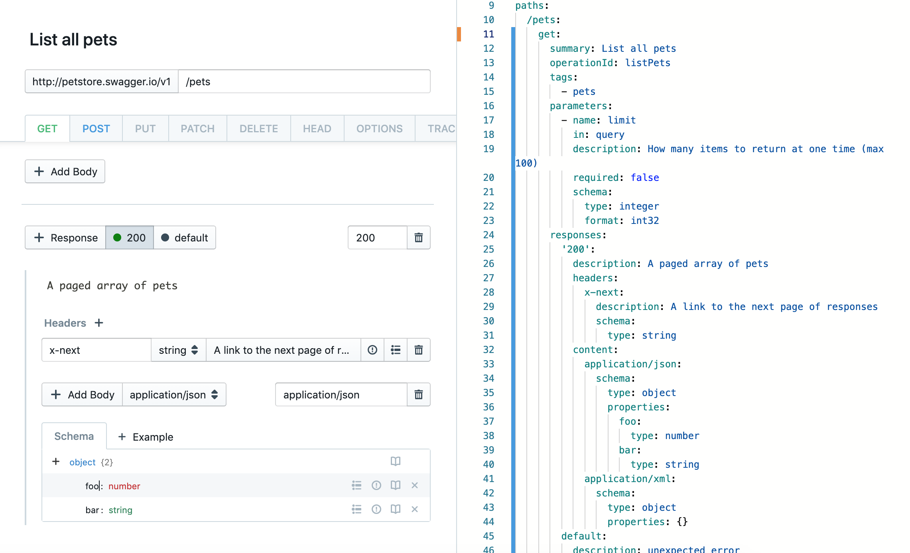

# Working with Models

Stoplight's JSON Schema editor allows you to easily design and model data structures
used by your API. The JSON Schema editor is especially useful for:

- Drafting API request and response bodies under an API endpoint
- Creating models for your API

There are two different methods for generating a CRUD model:

- Using the JSON Schema **editor**, which allows you to create data structures
  in an easy-to-use, graphical format

- Using the **Raw Schema** editor, if you would prefer to modify the data
  structure with raw JSON

While each method can be used individually, you will most likely find yourself
using a combination of both methods while drafting API endpoints, models, and
responses.

## Using the Editor

We created the JSON Schema editor to make data structure creation as simple as
possible. You can find the JSON Schema editor within any model or endpoint while [**Form View**](../ui-overview.md) is selected.

To start utilizing the editor:

- Click **+ Add Body** or **+ Response** within a model or endpoint

- Click the **+** (plus) icon next to the root **object** to start adding fields
  to the data structure. The plus icon can also be used on nested objects to
  create a hierarchy of arbitrarily-nested data structures

- Set the **field name** (or _key_) of a data field by clicking the text label
  to the left of the newly-created field. Field names can be composed of any
  alpha-numeric characters, but can only be specified once. You will receive an
  error if you try to re-use field names multiple times on the same level
  (though they can be re-used on nested objects)

- Set the **type** of a field by clicking the _string_ label to the right of
  the field name. The default type for a newly-created field is 'string',
  however other types include:

  - objects (for nesting objects)
  - arrays
  - numbers
  - integers
  - booleans
  - nulls
  - [references](07-using-references.md)

  Field types can also include _Combination Types_, which include 'allOf',
  'oneOf', and 'anyOf'. These special types allow for object inheritance from
  other data structures and models.

- Optionally, you can set extra validations on the field, for example:

  - **Enumerations** (or _enums_ for short) allow you to restrict the contents
    of the field to be specific values. For example, if you are creating a
    'color' field of type string, you may want to restrict the strings used in
    that field to specific colors (red, blue, green, etc).

  - **Format** allows for validating the field value is of a specific format. A
    few common format validations include: date, time, date-time, URI, and
    email.

  In addition to the validations listed above, there are also per-type
  validations that can be used depending on the type of the field. For example,
  string validations include setting a minimum/maximum length and regex pattern.
  For numbers, you can set minimum/maximum values and even validate that the
  numeric value is a multiple.

- Optionally, you can specify a field as **required**, which ensures that the
  field is present in all requests (and an error is thrown otherwise).

## Editing the Raw JSON Schema

While not for the faint hearted, you can also edit the raw JSON schema directly
if you are familiar with the format, or have a pre-existing JSON schema
representation of your data structure.

To edit the raw JSON schema, [switch to the **Write View** tab](../ui-overview.md) next to the **Form View**
tab. This will switch you over to the Write view which will allow you to make edits directly in the raw schema.

## Try it Out

When modeling endpoints, you can use [our built in HTTP client](./05-request-maker.md) to hit either a real API (a development server, production, etc) or a [mock server](./06-mock-servers.md).
