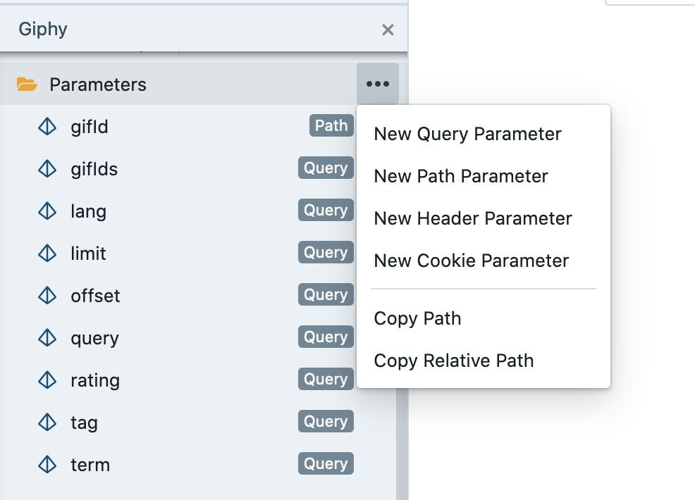
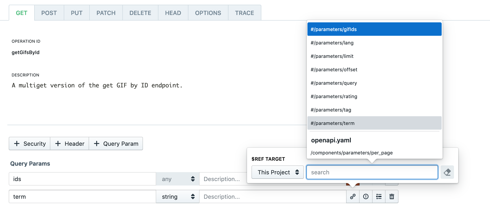
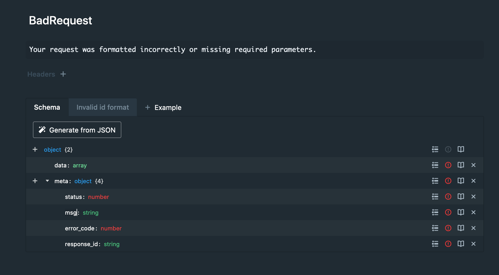
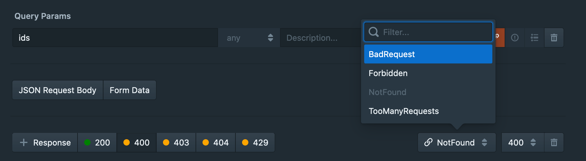

# Shared Components

When using Stoplight, or OpenAPI in general, there are various different
components that can be either defined within an endpoint, or reused between
multiple endpoints. To help reduce repetition (and the chance of introducing
errors), it is important to:

* Identify endpoints with common parameters, schemas, or responses.
* Use _shared components_ to reference the same component multiple times instead
  of rewriting the properties for each individual endpoint.

Shared components in Stoplight come in several forms:

* **Parameters** - Parts of the request: query string parameters, path parameters, headers, and cookies. 

* **Responses** - Common responses like page not found, validation errors, etc. 

* **Models** - Also known as "Schemas", these are the most common shared component. They describe the actual shape of the data for JSON requests and responses.

* **Examples** - Show how a request or response body might look. These can be generated from schemas automatically, but can also be made manually created for more complex scenarios.


## Shared Parameters

Describing a HTTP request involves talking about the URL, method, body, all of which are covered elsewhere, but everything else is a parameter. 

  * **path** - Dynamic values in the path part of the URL, e.g.: `/people/{id}`.
  * **query** - Dynamic values in the query string part of the URL, e.g.: `/planets?name=Endor`.
  * **header** - Custom headers that are expected as part of the request.
  * **cookie** - Used to pass a specific cookie value to the API.



Attributes and validations can be added to the parameter values to describe things like data type, default values, examples, restrict to a specific set of values (enum), and even marking parameters as deprecated to signal to API consumers that the parameters should no longer be used.

To use a shared parameter, navigate to an API endpoint, and click go to the "Path Params" section, or in the HTTP request information click Headers or Query Parameters. For any of these parameters, the chain link icon is a button, that will let you pick the parameter to reference. 



Once the parameter has been referenced, any updates to the
shared parameter will automatically be propagated to every endpoint using that
parameter. Like other references in Stoplight, shared parameters can also be shared across
files, projects, and other external sources.

### Shared Parameters Example

Let's say you are creating an API to serve thousands of cooking recipes. When dealing with large volumes of
data, you typically want to avoid sending _all_ data in a request. To help avoid
sending more data than is necessary, most applications implement a "paging"
feature that allows clients to retrieve a small portion of results (i.e. a single
page).

There are multiple ways to approach a paging feature. For this example, we
want to add two query string parameters to every request:

* `limit` - The number of results to return when viewing a page. For example,
  setting `limit` to `20` means that, at most, 20 results will be returned in the
  request.
* `offset` - The number of results to skip before returning results. For
  example, setting an `offset` of `20` means that the API will discard the first
  20 results.

By using the two parameters above, a client can efficiently "page" through
results, only returning items that are within the requested bounds. To demonstrate, let's use the parameters to display the first page of our recipe
results:

```
GET /recipes?limit=20&offset=0
```

Since the `offset` is set to `0`, the API will not discard any results. Paired
with a `limit` of `20`, we will only see the first 20 results (1 through 20). 

To view the second page of recipes, we would use:

```
GET /recipes?limit=20&offset=20
```

By setting an `offset` of `20`, the API will discard the first 20 results. Paired
again with a `limit` of `20`, we will see the second page of results (21 through
40).


## Shared Responses

Similar to shared parameters, shared responses allow you to reference a single response
multiple times without having to recreate each response manually. The added
benefit of this approach is that updates to the shared response object are
automatically propagated to any endpoint using that object, no extra changes
required.

Shared responses allow you to configure the following properties:

* Headers - Customize the HTTP Headers returned in the response
* Response body - Customize the HTTP message body contents using the Stoplight
  modeling tool (or reference a pre-existing model)

To use a shared response, navigate to an API endpoint's **Response** section and
create a reference to the shared response by choosing the _Type_ of the response
as "Reference". Once the Response type is set to "Reference", you can then
choose the shared response to use for that endpoint. Shared responses can also
be shared across files, projects, and other external sources.

### Shared Responses Example

Let's say you have a set of API endpoints that should return the same error
response when a failure occurs. Every time an error is returned from the API,
the API a custom error format instead of using a standard one like [RFC 7807](https://tools.ietf.org/html/rfc7807):

* `msg` - A descriptive error message about the failure in string format.
* `error_code` - A code representing the category of the failure in integer format.
* `response_id` - A tracking ID that can be used by the caller to follow-up with
  an administrator for more information (i.e:, debug an issue with customer
  support).

Now that we know what should be returned, let's create a shared response in
Stoplight. To get started, create a new shared response for an OpenAPI document
under the "Responses" section of the sidebar.


_This response is part of the <a href="https://meta.stoplight.io/docs/sample-specs/reference/giphy/giphy.yaml">Giphy</a> example in sample-specs._

Create a new shared response, giving it a name like `BadRequest`, `NotFound`, `Forbidden`, etc.

Add the schema, or reference one that already exists, with the properties that will appear in the HTTP body.

Add a short description of the error response, such as what is likely to have triggered it, and where the user can find out more information to resolve it. If documenting an API error, and the error message itself has links and sufficient information to solve the problem, then this can be more brief.

Then, maybe even add an example!

Once the shared response has been created, it can be referenced in any API endpoint by clicking the chain link icon. 



Now whenever you update a response it will update in every endpoint using this response.

## Shared Models

While designing your APIs, you will often find yourself repeating structures in your endpoint request and response bodies. For example, you might have an API endpoint that returns a list of users, and another endpoint that returns a single user. The response structures of these two endpoints will be very similar - one is responding with an array of user objects, and one is responding with a single user object.

Models allow us to describe these common structures (for example, a User object), and then reference the object from our endpoint definitions, or even from other models. Then, we only have one place to update if we need to change anything about the user object, instead of many places.

## Shared Examples

Shared Examples can be applied to a request body or a response body, or applied to another model so that it will show up anywhere. Defining an example gives you more power over how that model is displayed in mock servers and documentation tools. 

