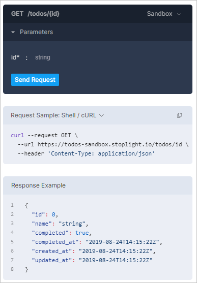
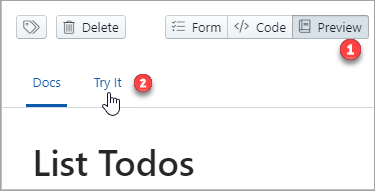
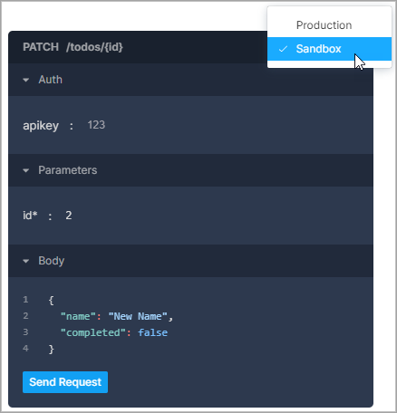
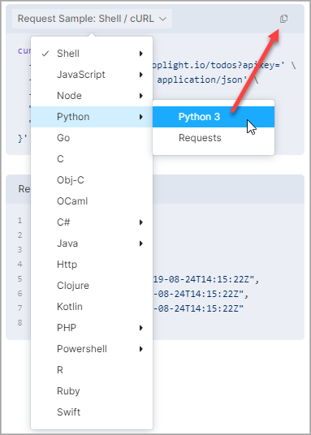

# Try It

Stoplight Studio enables you to preview and test your API operations as you work or as people read your documentation.

<!--
focus: false
-->

For each request, you can:

- Provide authorization and parameters as part of each request.
- Select from servers defined in the API description.
- Enable mocking and choose to generate static or dynamic URLs. See [Mock Servers](06-mock-servers.md).  
- Automatically generate a request code sample for your preferred language type.

## Send Requests

1. Open Try It:
    - From published API documentation, select an operation. 
    - In Edit mode, select an operation, select **Preview**, and then select the **Try It** tab. 
<!--
focus: false
-->
  

2. Provide Auth and parameters as required by the operation. 

3. Select a server for the request, if multiple servers are defined in your API description.

<!--
focus: false
-->

4. Select **Send Request**.

The response is returned.

## Get Sample Request Code

In the Request Sample box, select a language, and then select the copy icon.

<!--
focus: false
-->
  

