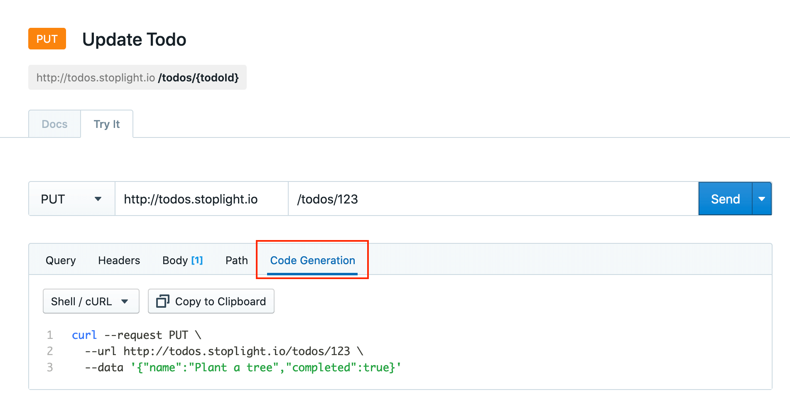
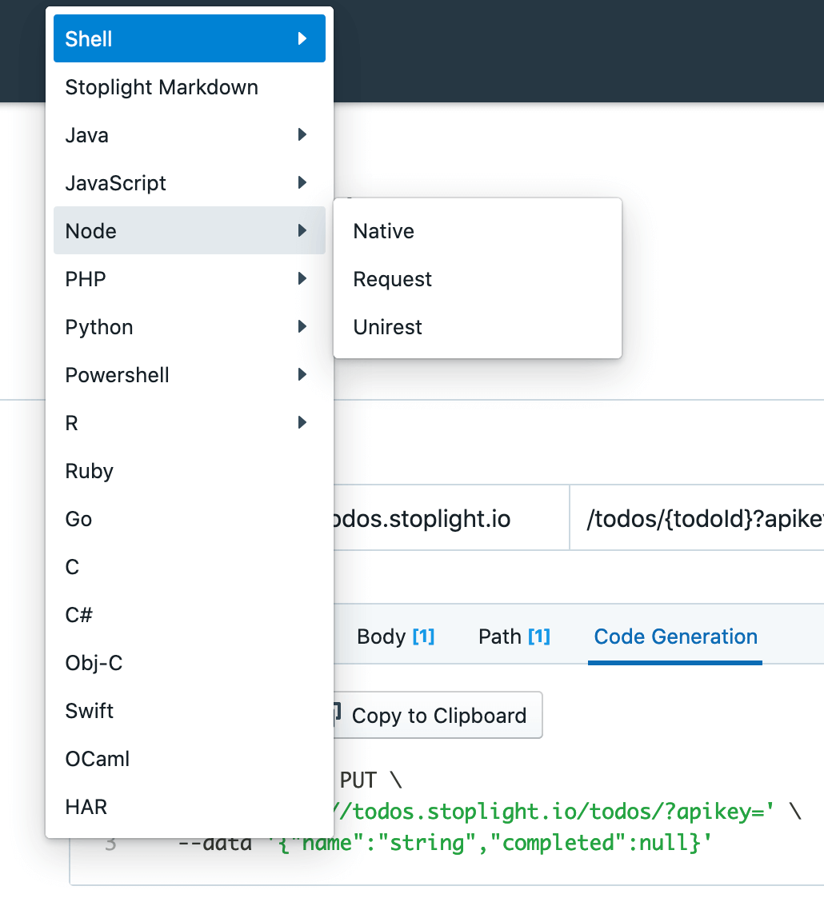

# Generating Code Snippets
**Recommend removing this topic since all of the content is in Try It topicXXX**

When you are happy with the requests you've made in [Request Maker](./05-request-maker.md) (our HTTP client), you can turn the requests into actual code for pasting into your codebase.

This can reduce the time to first request massively for yourself, for co-workers, or for anyone else viewing the documentation. 

To generate code:

1. From within a project, select any of the API endpoints from the API sidebar menu on the left.
2. When viewing the endpoint, click the **Preview** button at the top right of the screen.
3. From there you can modify a request in any way you want, and click **Code Generation**.

## Selecting a Language

By default you will see the **Shell / cURL** showing up, which is for working on the command line with a very common library called `curl`. 

Click the dropdown on the left to select different languages, most of which support a few different libraries. 

### Supported Languages

Language | Library
---------|----------
Shell | cURL
Shell | HTTPie
Shell | Wget
Java | Unirest
Java | OkHttp
JavaScript | XMLHttpRequest
JavaScript | jQuery
NodeJS | Native
NodeJS | Request
NodeJS | Unirest
PHP | ext-curl
PHP | pecl/http 1
PHP | pecl/http 2
Python | Python 3
Python | Requests
Powershell | WebRequest
Powershell | RestMethod
R | httpr
Ruby | |
Go | |
C | |
C# | |
Obj-C | |
Swift | |
OCaml | |
HAR | |

> These code snippets come from the open-source package [httpsnippet](https://github.com/Kong/httpsnippet), so if you'd like to contribute more, first send them a pull request then open an issue on [our GitHub repository](https://github.com/stoplightio/studio/issues).

## Advanced Code Generation

If you'd like to go further with code generation, consider looking into on of the many top quality code generators listed on [OpenAPI.Tools](https://openapi.tools/).
