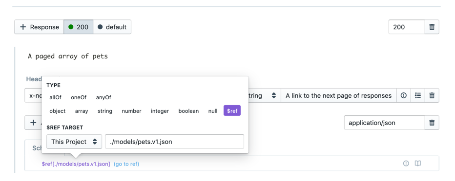

# Using References

## What

Splitting your API descriptions across multiple files using $ref (references) allows for cleaner and more organized code. 

Some common use cases are as follows:

- De-duplicate common structures like models, reducing repetition and allowing them to be used for other purposes like [contract testing](https://apisyouwonthate.com/blog/writing-documentation-via-contract-testing).
- Similar parameters or headers can be shared across multiple endpoints.
- Examples for request or response bodies can be reused.

## How

1. Select an **endpoint** or **model**
2. Create a **request body** and/or **response body**
3. Within the JSON Schema Viewer, add a new property by clicking the + button or modify an existing property by selecting the property
4. Select **\$ref** in the proceeding window
5. Select a **\$ref target**
6. Select the file you want to reference
