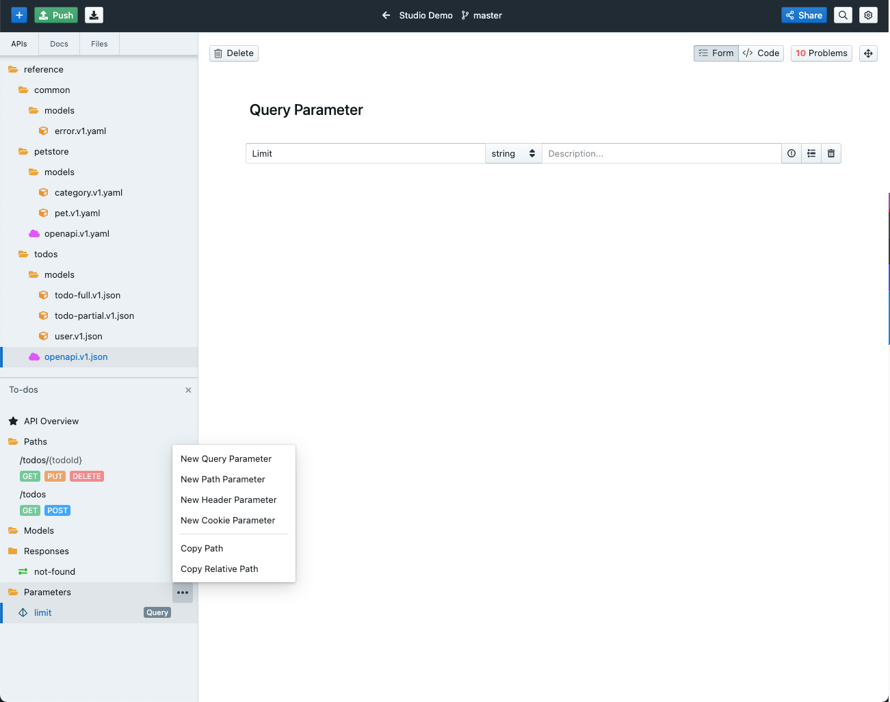
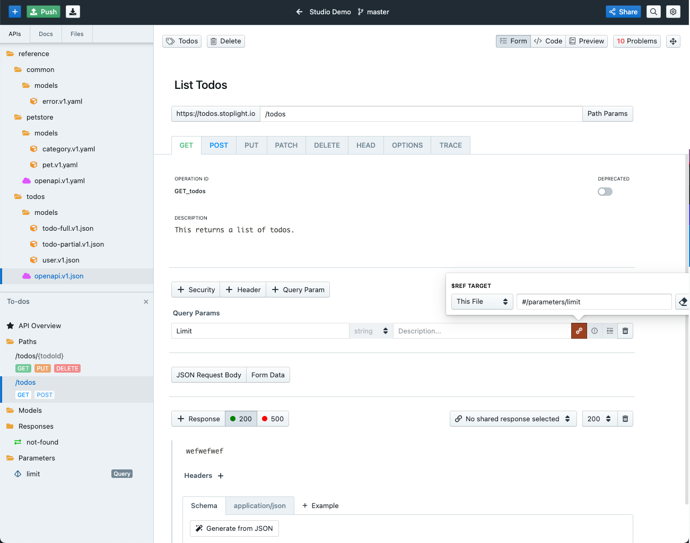

# Shared Parameters and Responses

While designing API’s in Stoplight, it is common to have multiple endpoints share a set of query parameters and API responses. To help reduce extra work (and the chance of introducing errors), it is important to:
- Identify endpoints with common parameters
- Use *shared components* to reference the same property multiple times instead of rewriting the properties for each individual endpoint.

Shared components in Stoplight come in two forms:
- **Parameters** - These are shared parameters that can be applied to requests across multiple endpoints.
- **Responses** - These are shared response objects that can be applied to multiple endpoints.

## Parameters

Shared parameters provide a way to use request properties across multiple API endpoints without having to duplicate effort.

Shared parameters are currently supported in the following request property locations:

- **path** - Parameters that are part of the operation's URL
- **query** - Parameters that are appended to the URL
- **header** - Custom headers that are expected as part of the request
- **cookie** - Used to pass a specific cookie value to the API

