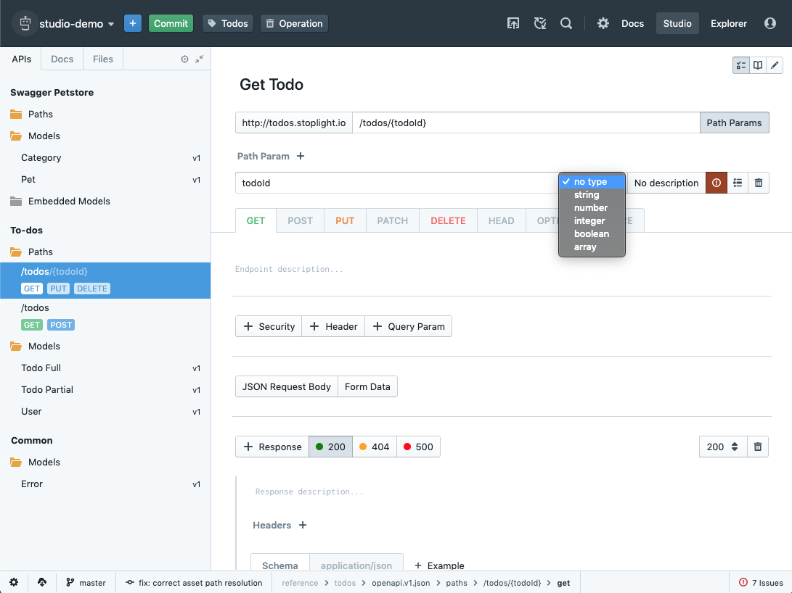

# Setting Path Parameters

In the OpenAPI format, "path parameters" are used to signify variables that are located in the path of an API endpoint. You can create, modify, or remove path parameters using Studio's "Forms" editor when viewing an API endpoint or method.

To modify path parameters within the Forms editor in Studio:

1. From within a project, select any of the API endpoints from the API sidebar menu on the left
2. When viewing the endpoint, click the **Path Params** button immediately to the right of the endpoint path at the top of the Forms editor
3. From there you can add, modify, or remove path parameters from the endpoint definition
