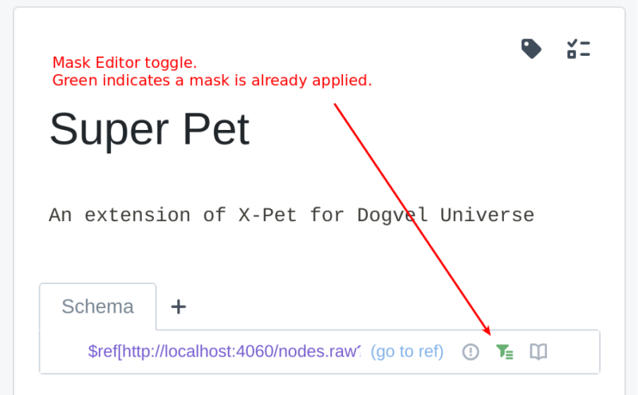
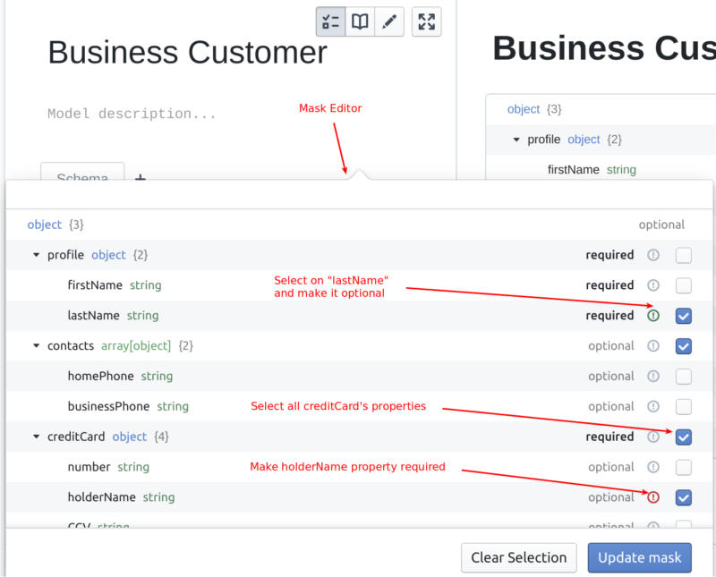
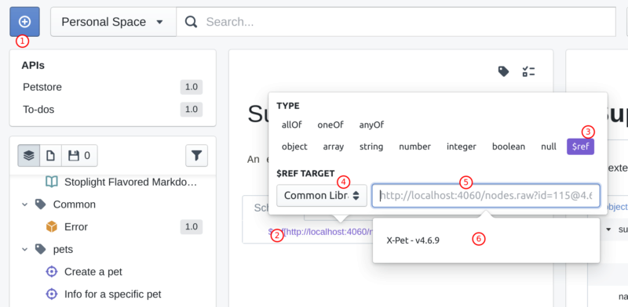
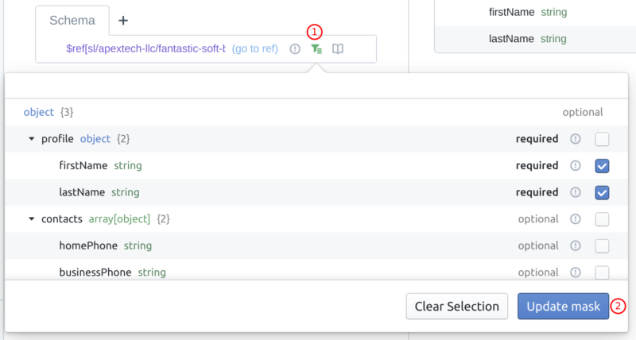
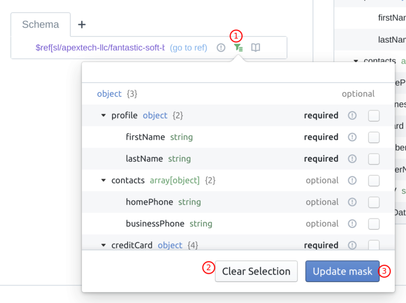
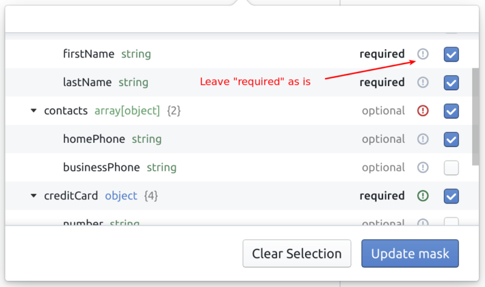
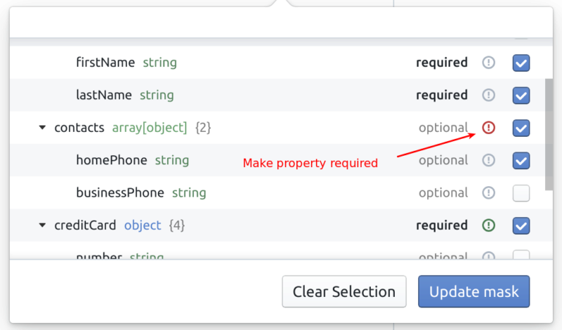
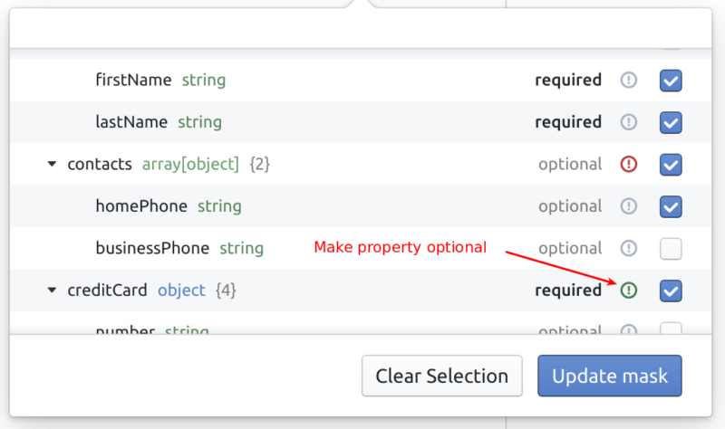

# Model Masking Reference

## Features

- Sub-select object properties, nested properties, array times, and allOf items.
- Alter the original "required" constraint for any object's property.
- Supports OpenAPI v2 and v3.

## Constraints

- Masks can only be applied to Common Models.
- Masks cannot be applied to `anyOf` and `oneOf` properties.
- Masks only work with `$ref`-ed models.

## UI Overview

### Json Schema Editor

### Mask Editor

## UI Operations

### Creating a Mask

In order to create a mask:

1. Make sure the `$ref`-ed model is a Common Model.
2. Create a model you want to apply a mask to.
3. Add a `$ref` property to that model.
4. From the dropdown, select "Common Model".
5. Search for a referenced model.
6. Select a model.
7. Click "Apply mask" button next to the `$ref` property.
8. Within the Mask Editor, select desired properties and/or manipulate the "required" property.
9. Click "Apply mask" button.

Here is a rough step by step guide in the UI:

### Updating a Mask

1. Given you already have a mask.
2. Click the "Update mask" button next to the `$ref` property.

> Node: the UI was slightly manipulated in this screenshot for the purpose of this example. The popup was shifted right.

### Removing a Mask

Removing a mask is accomplished by simply removing all checked properties from the existing mask.

1. Click "Update mask" toggle in the Json Schema Editor row.
2. In Mask Editor, click "Clear Selection" to uncheck all properties.
3. Click the "Update mask" button.

### Altering "Required"

Mask Editor supports altering the "required" constraint of JSON Schema objects.

We support three scenarios:

1. **Inherit** - Will inherit the required constraints from the original object.

2. **Force required** - Will overwrite the original objects "required" constraints and set them to true.

3. **Force optional** - Will overwrite the original objects "required" constraints and set them to false.

