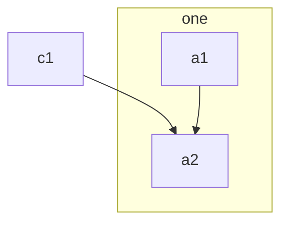
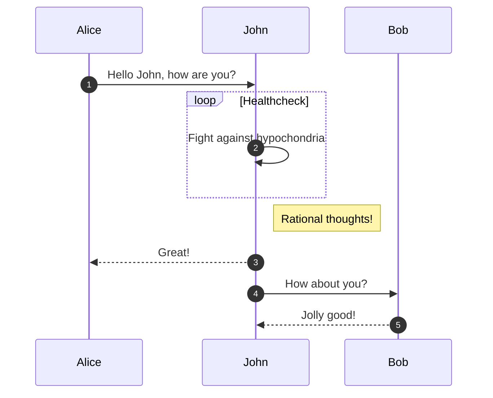
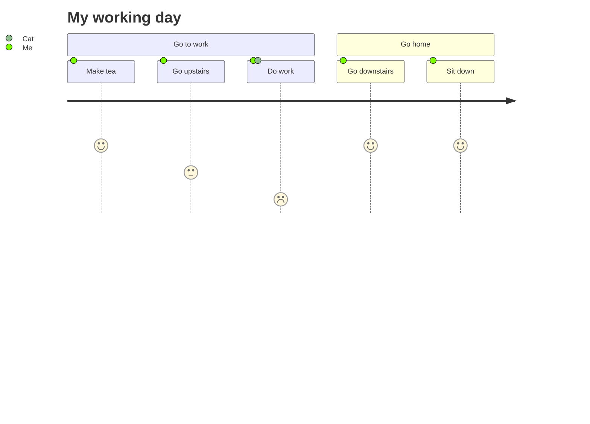

# Stoplight Flavored Markdown (SMD)

## Overview

Stoplight Flavored Markdown can be used to enhance existing Markdown documentation with necessary documentation components like code blocks, images, diagrams e.t.c. 

### Components

- [Stoplight Flavored Markdown (SMD)](#stoplight-flavored-markdown-smd)
  - [Overview](#overview)
    - [Components](#components)
    - [The Two Laws](#the-two-laws)
    - [The Approach](#the-approach)
  - [Callouts](#callouts)
    - [Danger](#danger)
    - [Warning](#warning)
    - [Success](#success)
    - [Info](#info)
  - [Task Lists](#task-lists)
  - [Code Blocks](#code-blocks)
    - [Markdown Annotations](#markdown-annotations)
    - [Meta Tag Annotations](#meta-tag-annotations)
  - [Code Groups](#code-groups)
  - [Images](#images)
  - [Graphs and Diagrams](#graphs-and-diagrams)
    - [Flowchart](#flowchart)
    - [Sequence](#sequence)
    - [Journey](#journey)
  - [JSON Schema](#json-schema)
  - [Try It](#try-it)
    - [Basics](#basics)
    - [Optional Parameters](#optional-parameters)
  - [Tabs](#tabs)
  - [HTML](#html)
  - [Embeds](#embeds)
    - [Supported Websites](#supported-websites)

### The Two Laws

1.  SMD is human readable. A human with a simple text editor can easily read and write SMD.
2.  SMD degrades gracefully. SMD documents rendered on `github.com` should be clean and readable.

### The Approach

1.  Stoplight Flavored Markdown extends GitHub Flavored Markdown with inline comment annotations.
2.  The value inside of the annotations is a YAML object, and the annotation affects the Markdown block that directly follows it in the document.

By leveraging comments to store annotations, Stoplight Flavored Markdown degrades gracefully to any other Markdown
renderer (GitHub, for example).


## Callouts

A callout is an MD blockquote with an optional annotation that indicates intent.

### Danger

<!-- theme: danger -->

> #### Danger Will Robinson!
>
> Here is my danger callout!

```md title="Copy this code to try it out!"
<!-- theme: danger -->

> #### Danger Will Robinson!
>
> Here is my danger callout!
```

### Warning

<!-- theme: warning -->
> #### Watch Out!
>
> Here is my warning callout!

```md title="Copy this code to try it out!"
<!-- theme: warning -->
> #### Watch Out!
>
> Here is my warning callout!
```

### Success

<!-- theme: success -->

> #### Mission Accomplished!
>
> Here is my success callout!

```md title="Copy this code to try it out!"
<!-- theme: success -->

> #### Mission Accomplished!
>
> Here is my success callout!
```

### Info

<!-- theme: info -->

> #### A thing to know
>
> Here is my info callout

```md title="Copy this code to try it out!"
<!-- theme: info -->

> #### A thing to know
>
> Here is my info callout
```


## Task Lists

- [ ] one
- [x] two
- [ ] three

```md title="Copy this code to try it out!"
- [ ] one
- [x] two
- [ ] three
```

## Code Blocks

An SMD code block is an MD code fence with an optional annotation to tweak the presentation of the code block.

**Supported annotations**:
- **title**: Title for the code snippet
- **lineNumbers**: True/False to toggle line number visibility

### Markdown Annotations
<!--
title: "My code snippet passed via md annotations"
lineNumbers: true
-->

```javascript
function fibonacci(num) {
  var a = 1,
    b = 0,
    temp;

  while (num >= 0) {
    temp = a;
    a = a + b;
    b = temp;
    num--;
  }

  return b;
}
```

```example title="Try the annotations out!"
<!--
title: "My code snippet passed via md annotations"
lineNumbers: true
highlightLines: [[1,2], [4,5]]
-->
```

### Meta Tag Annotations

You can also pass the annotations via the code block meta tag.

```json title="Passed via meta tag" lineNumbers
{
  "foo": "bar"
}
```

```example title="Try the annotations out!"
json title="Passed via meta tag" lineNumbers
```

## Code Groups

If you write multiple code blocks with no other content between them they will be grouped into a tabbed code
group. This functionality is helpful for a variety of use cases, such as displaying code samples in a variety of
languages.

<!-- theme: warning -->

> Note that code groups cannot be nested in other elements like tabs.

```js title="Code groups work with titles and other annotations!" lineNumbers
// Install via npm
npm install --save my-library
```

```ruby title="Lovely isn't it?"
# Available as a gem
sudo gem install my-library
```

```php title="Enjoy!"
# Install the PHP library via Composer
composer require my-library
```

## Images

Use annotations to frame up product images.

**Default**

The default setting adds an outline and click to zoom for images. 


```md title="Try it out!"

```

**Center Focus**

Make screenshots pop out with a center focus and a default background image. 

<!-- focus: center -->


```md title="Try it out!"
<!-- focus: center -->


```

**Add a Caption**

Add an optional caption to explain the screenshot further. 

<!-- focus: top -->


```md title="Try it out!"
<!-- focus: top -->


```

**Try a Different BG Color**

<!--
focus: top
bg: primary
-->


```md title="Try it out!"
<!--
focus: top
bg: primary
-->


```

**Use a hex BG Color**

<!--
focus: top
bg: "#f78ae0"
-->


```md title="Try it out!"
<!--
focus: top
bg: "#f78ae0"
-->


```

**Good Old Plain Images**

<!-- focus: false -->


```md title="Try it out!"
<!--
focus: false
-->
```

## Graphs and Diagrams

You can add graphs and diagrams in your Markdown using [Mermaid syntax](https://mermaid-js.github.io/mermaid/#/flowchart). They support all sorts of common UML diagrams, like sequence diagrams, class diagrams, state diagrams, ERDs, User Journey, Gantt, pie charts, etc. 

Wrap any Mermaid syntax with a `mermaid` code block. 

<!-- theme: warning -->

> Note that diagrams cannot be nested in other elements like tabs or code groups.

### Flowchart



```example
graph TB
    c1-->a2
    subgraph ide1 [one]
    a1-->a2
    end
```


### Sequence



```example
sequenceDiagram
    autonumber
    Alice->>John: Hello John, how are you?
    loop Healthcheck
        John->>John: Fight against hypochondria
    end
    Note right of John: Rational thoughts!
    John-->>Alice: Great!
    John->>Bob: How about you?
    Bob-->>John: Jolly good!
```

### Journey



```example
journey
    title My working day
    section Go to work
      Make tea: 5: Me
      Go upstairs: 3: Me
      Do work: 1: Me, Cat
    section Go home
      Go downstairs: 5: Me
      Sit down: 5: Me
```


## JSON Schema

The SMD JSON schema block is an MD code block with an additional `json_schema` language tag. The contents of the code
fence should be the JSON schema object to be rendered. The primary language tag can be `YAML`, `YML`, or `JSON`.

```json json_schema
{
  "title": "User",
  "type": "object",
  "properties": {
    "id": {
      "type": "string"
    },
    "name": {
      "type": "string",
      "description": "The user's full name."
    },
    "age": {
      "type": "number",
      "minimum": 0,
      "maximum": 150
    }
  },
  "required": ["id", "name"]
}
```
Try it out with the example below:

```json title="Try it out!" 
```json json_schema
{
  "title": "User",
  "type": "object",
  "properties": {
    "id": {
      "type": "string"
    },
    "name": {
      "type": "string",
      "description": "The user's full name."
    },
    "age": {
      "type": "number",
      "minimum": 0,
      "maximum": 150
    }
  },
  "required": ["id", "name"]
}
```

## Try It

### Basics

Writing a `json` code block with the `http` tag added results in displaying a "Try It" component.

The simplest way to use it is to provide `method` and `url` parameters, both of which are obligatory:

````json
```json http
{
  "method": "GET",
  "url": "https://todos.stoplight.io/todos",
}
```
````

This results in the following component being displayed:

```json http
{
  "method": "GET",
  "url": "https://todos.stoplight.io/todos",
}
```

### Optional Parameters

There are also optional parameters that you can provide to the component. 

`query`, `headers`, and `body` parameters allow you to create a Try It component that supports sending requests with a query, header, and/or body content. Users can fill and edit those contents and then send the request.

So, for example, if we wanted to use `query`, `headers` and `body` all at the same time, we would write:

````json
```json http
{
  "method": "POST",
  "url": "https://todos.stoplight.io/todos",
  "headers": {
    "Content-Type": "application/json"
  },
  "query": {
    "name": "query value"
  },
  "body": {
    "some parameter": "some value"
  }
}
```
````

This would result in the following component:

```json http
{
  "method": "POST",
  "url": "https://todos.stoplight.io/todos",
  "headers": {
    "Content-Type": "application/json"
  },
  "query": {
    "name": "query value"
  },
  "body": {
    "some parameter": "some value"
  }
}
```

If you prefer, for readability sake you might also want to use `baseUrl` parameter, which allows you to write the following.

````json
```json http
{
  "method": "GET",
  "url": "todos",
  "baseUrl": "https://todos.stoplight.io",
}
```
````

Currently, it doesn't affect the functionality in any way, but can be used for readability purposes. In the future, we might introduce features in Try It, that actually utilize this parameter.

## Tabs

An SMD tab container is a `tab` annotation, followed by the tab content, and closed by a final `tab-end` annotation.

<!-- theme: danger -->

> Tab containers cannot be nested.

<!--
type: tab
title: My First Tab
-->

The contents of tab 1.

<!--
type: tab
title: My Second Tab
-->

The contents of tab 2.

<!-- type: tab-end -->

```md title="Try it out!" 
<!--
type: tab
title: My First Tab
-->

The contents of tab 1.

<!--
type: tab
title: My Second Tab
-->

The contents of tab 2.

<!-- type: tab-end -->
```

## HTML

Most basic HTML is supported. **However, we highly recommend using the Markdown equivalent whenever possible.**
<table>
  <thead>
    <tr>
      <td>heading 1</td>
      <td>heading 2</td>
    </tr>
  </thead>

  <tbody>
    <tr>
      <td>hello</td>
      <td>world</td>
    </tr>
  </tbody>
</table>

---

## Embeds

We support embedding a variety of content from popular websites! To use an embed, just write out a link in its own paragraph.

For example, this is a YouTube video:

https://www.youtube.com/watch?v=VbSPeYo8dfM

```md title="Try it out!" 
https://www.youtube.com/watch?v=VbSPeYo8dfM
```

This is a Giphy Gif:

https://giphy.com/gifs/barkpost-barkpost-happy-wednesday-working-like-a-dog-eYilisUwipOEM

```md title="Try it out!" 
https://giphy.com/gifs/barkpost-barkpost-happy-wednesday-working-like-a-dog-eYilisUwipOEM
```

We support audio too:

https://open.spotify.com/episode/7jobY4wQXnt1T0E9iwVRte

```md title="Try it out!" 
https://open.spotify.com/episode/7jobY4wQXnt1T0E9iwVRte
```

<!-- markdown-link-check-disable -->

### Supported Websites

- Coding
  - [Github Gist](https://gist.github.com)
  - [CodeSandbox](https://codesandbox.io)
  - [Codepen](https://codepen.io)
  - [Runkit](https://runkit.com)
  - [Replit](https://replit.com)

- Video
  - [YouTube](https://www.youtube.com)
  - [Vimeo](https://vimeo.com)
  - [Grain](https://grain.co)
  - [Giphy](https://giphy.com)

- Audio
  - [Spotify](https://www.spotify.com)
  - [SoundCloud](https://soundcloud.com)

- Design
  - Figma
  - [Slideshare](https://www.slideshare.net)
  - [SpeakerDeck](https://speakerdeck.com)

- Social
  - [Twitter](https://twitter.com)
