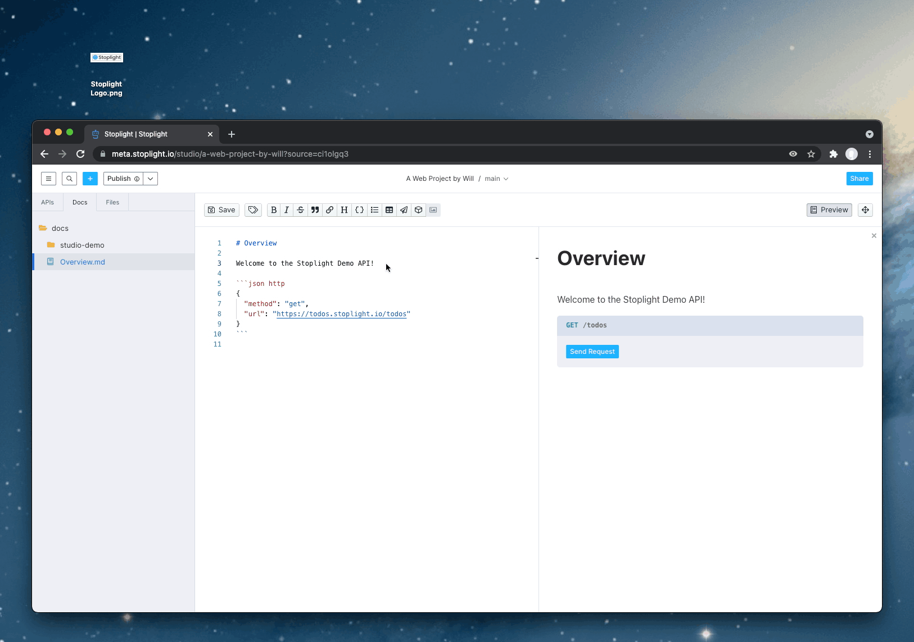

# Using Images

Using images in Stoplight is now easier than ever. Add images to your project to create beautiful documentation layouts that supplement text content.

## Add Images

Drag and drop image or copy and paste an image into a markdown article to upload it. 

> These images are stored in Stoplight and respect project permissions i.e. Private vs Internal.

## Customize Images

To customize images like adding backgrounds, captions or focus, check out [images in Stoplight Flavored Markdown](03a-stoplight-flavored-markdown.md).