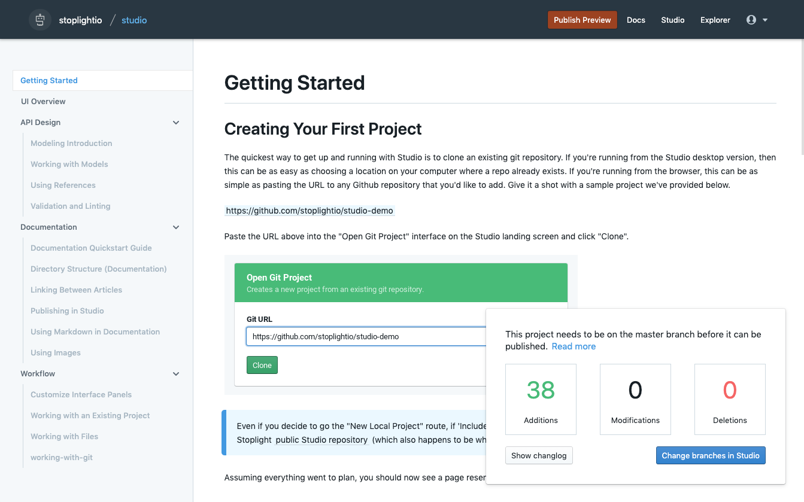

# Publishing in Studio 

<!-- theme: warning -->
> This functionality is only available in the **web** version of Stoplight Studio

<!-- theme: danger -->
> Files **must** be stored in a Git repository to be published



## What
Instantly Publish API Specifications, Models, and supplemental markdown files and images. One-click publish significantly reduces time to production and produces beautiful, modern, developer-centric documentation. 

## How
1. Open an existing **Git Project** or create a new Git Project  
2. Click the **Docs** button in the top right to preview your docs (optional)
3. Click the **Publish** button on the top nav bar 
4. Select **Publish** in the bottom right of the docs preview page

## Published Documentation URL

```
https://stoplightio/p/docs/gh/{org}/{project}
```

## Documentation Hierarchy/Structure
How files in Studio will be displayed in your documentation.

### I. Markdown
```
1. Untagged markdown files (ordered alphabetically by filename)  
2. Markdown Groups (ordered alphabetically by tag name)
    a. Tagged markdown files (ordered alphabetically by filename)
```
### II. API References
```
1. API Specification files (ordered alphabetically by filename) 
    a. Tagged Endpoint Groups (ordered alphabetically by tag name)
        i. Tagged Endpoints (Get, Post, Put, Patch, Delete, then additional operations as they occur in the spec)
        ii. Tagged Models (ordered alphabetically by filename)
    b. Untagged Endpoints (placed in ```Other``` Group, Get, Post, Put, Patch, Delete, then additional operations as they occur in the spec)
    c. Untagged Models  (placed in ```Other``` Group, ordered alphabetically by filename)
```

Read about [publishing via Continuous Integration](./03-publish-via-ci.md).
