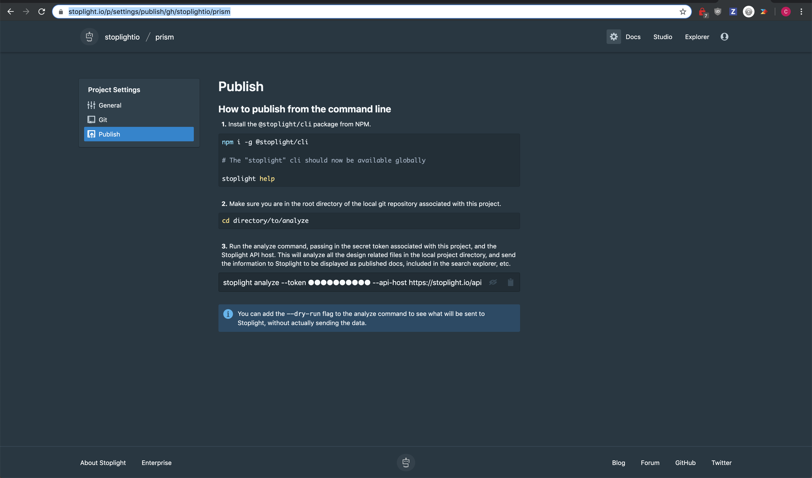

# Publish via Continuous Integration

The "Publish" button in Studio is a quick and convenient way to publish changes (e.g.: updating documentation), but if you are working with a whole team of people, it can become a bit of a bother. Maybe they commit some changes to master and forget to publish them after their pull request is merged.

To handle this, we have a handy CLI package which can automate publishing changes happening via Git.

1. Install the `@stoplight/cli` package from NPM

```bash
npm i -g @stoplight/cli

# The stoplight command should now be available globally

stoplight -h
```

2. Make sure you are in the root directory of the git repository associated with this project.

```bash
cd directory/to/analyze
```

3. Run the analyze command, passing in the secret token associated with this project (the project token can be found in the project settings publish section). This will analyze all the design-related files in the project directory, and send the information to Stoplight.

```bash
stoplight analyze --token {project-token}
```

> You can add the `--dry-run` flag to the analyze command to see what will be sent to Stoplight, without actually sending the data.

To find this token, head to `https://stoplight.io/p/settings/gh/{org}/{project}` in your browser, and click "Publish".


