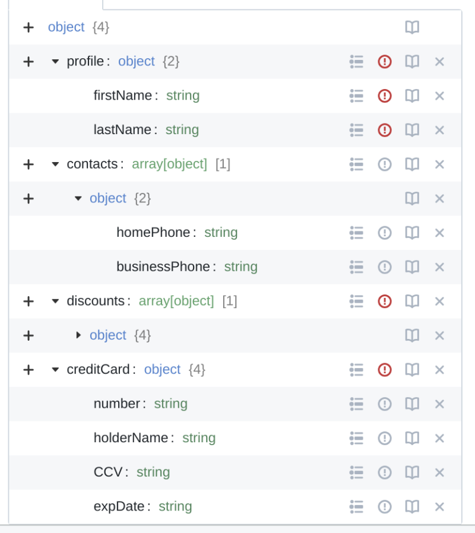
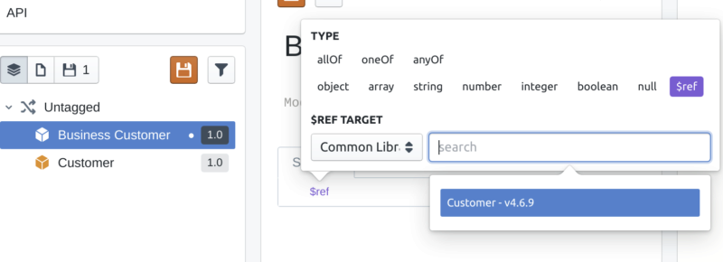
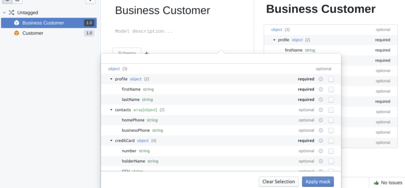

# Model Masking Guide

Stoplight Studio supports the concept of a common library, which allows API designers to re-use design assets such as models across projects. Some of these models can contain hundreds of attributes.

When a developer references a common model from their own API design / model, they might only need a subset of the common model's properties, and **Model Masking** is how Studio users can do that

## How To Use The Feature

> The prerequisite is to have a `Common Model` defined.

Let's say we're building a *Flights Control System* application and one of the models we often reuse is `Customer`. Since we know we use this across our organization we decided to mark it as a `Common Model`.

That model, although very reusable, carries a lot of information that we don't always need. Take a look at the image below:

As you can see it defines plenty of properties (including nested objects).

This is all great! 

But what if our boss comes in and says "Hey you, the one in the red t-shirt! By the end of tomorrow we need to support business customers, make sure they don't get discounts. I'm sure you can do it!"

Sounds like a task! Clearly we'd like to minimize the effort and we think about reusing the `Customer` model. But not the whole lot, just a **subset**. How do we do that? Let's find out!

### Step One: Create Your Desired Model

We'll call our new model `BusinessCustomer`. We know it is composed of the same properties as 'Customer" except for one, 'discounts'.

We first need to [create a model using Studio](./model-masking-reference.md).

Then we need to *reference* a target model, `Customer`.

In order to do so, we'll create a top level `$ref` property. The next thing we need to do is change the `$REF TARGET` to `Common Library` and type in `Customer` in the search bar.

Once we do that we'll see the reference `Customer - v4.6.9` appear.

> Note: If you had more than one version defined, you can switch between them and apply different masks!

### Step Two: Create a Mask

You'll see that when we reference a `Common Model` a new icon appears on the right hand side of it.

Click that icon to enable the Model Mask editor. It will let you select the properties you need for your subset.

Here is how it would look like if we selected required properties.

Now that this is done, we can click "Apply mask" to apply the mask to our model.

Note: Switching to the JSON Schema Viewer will display a "masked" model.

### Step Three: Modify "Required" Property

We'll now add a twist to the initial requirements. Let's say the `Business Customer` must, in contrast to the `Customer`, always include the `creditCard.holderName` property. In other words, that property should be **required**.

Masking allows us to do so. When selecting properties of the mask we can mark `holderName` as **required** and override the original constraint.

### Step Four: Bahamas!

Good job! We've went through a simple scenario and:

- created a new model referencing a common model
- created a mask over `Customer` and applied it to `Business Customer`
- altered the original model's **required** constraint

That's basically all there is to Model Masking. It's a simple yet powerful feature that will help you reuse your models!
