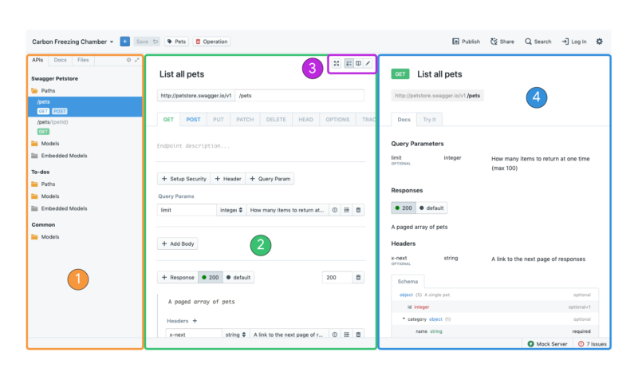

# UI Overview

1. **Project Selector**: Displays the currently selected project. Click to select a different project from the dropdown menu, search for a project, or create a new project. 

2. **Project Actions**: Contains actions to help you add new assets to your project. This includes creating new: APIs, Endpoints, Models, Articles, Images, Files, Folders, and Projects. 

3. **File tree**: Displays all Project files. Can toggle between **APIs** file tree (APIs, endpoints, and models), **Docs** file tree (markdown and image files), **Files** file tree (all files), and **Git** (not displayed, Pull/Push Git functionality). 

4. **Primary Panel**: Main editor panel. Can switch between view types via the view toggle in the top right of the panel (not shown, must hover over panel for toggle to appear).

5. **Secondary Panel**: Additional editor panel. Can switch between view types via the view toggle in the top right of the panel. Only available on larger screens (width > 1400px). 

6. **Mock Server**: Run mock servers (powered by Prism) and view mock server logs. 

7. **Validation and Linting**: Displays issues related to your API Specification (powered by Spectral). Click to expand window and view error and warning details and locations. 

8. **Publish**: Click to publish documentation. Only available in the web application. 

9. **Search**: Search through all Project specific files.  

## Customizing the Interface Panels 

1. **File tree Panel**: Displays API Specifications, Endpoints, & Models (APIs Tab), Markdown & Image Files (Docs Tab), All Files (Files Tab) 
2. **Main Panel**: Displays Form View, Read View, or Write View 
3. **View Toggle**: Switch between Form View, Read View, or Write View 
4. **Secondary Panel**: Displays Form View, Read View, or Write View (Only available for larger screens)

### What
Studio provides a customizable two panel (smaller screens) or three panel (larger screens) layout to give you control over what information you would like to display and where. Expand windows when focused on a single task. Switch between Read, Write, and Form Views for individual panels to maximize efficiency. 

### How 
1. Select an endpoint, model, or markdown file. 
2. Hover over the **Main** or **Secondary Panel**
3. Switch between view modes via the **View Toggle** buttons in the top right of the panel  

