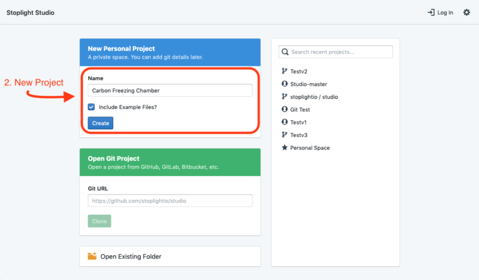
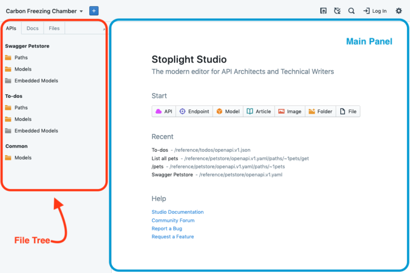
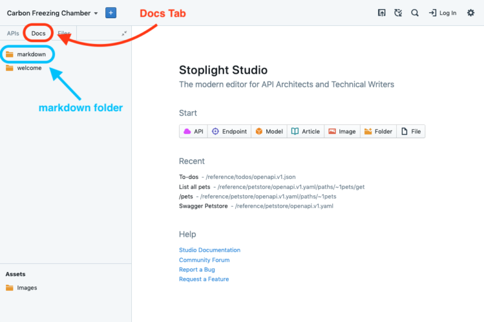
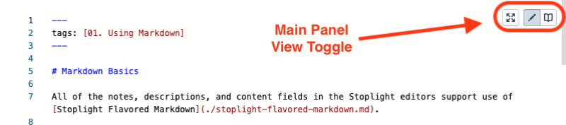

# Documentation Quickstart Guide 

Want to publish documentation? This quick start guide will provide you with the necessary steps to get you from API Specification to ready-to-publish API Documentation in 5 minutes flat. 

## 1. Open [Stoplight Studio](https://stoplight.io/p/studio)
The opening page of Stoplight Studio contains three options: create a **New Personal Project**, Open Git Project, and Open Existing Folder. 

## 2. Create a **New Personal Project** 
Create a New Personal Project by inputting a **Name**, select **Include Example Files”, and then click **Create. 

> “Include Example Files” will populate your Project with example files to help get you started 

Once you have created a New Personal Project, the first thing you will see is the APIs file tree on the left and the design panel taking up the bulk of the screen space to the right. 

The file tree to the left is where all of Stoplight’s Design files (API Specification: endpoints, models, paths, etc.) are stored and the main panel contains the [Table of Contents, API Design GUI, Read View, and Code View](link to switching panel view types). For more on API design, check out the [API Design Quick Start Guide](). 

## 3. Select Docs 

From Studio Home, select the file tree’s **Docs** tab to switch from the API Design workspace to the documentation workspace. This is where all documentation related files (markdown files and image files) can be created, managed, modified, and deleted. Since you selected “Include Example Files,” the left hand file tree will be populated by two folders: markdown and welcome and an Assets folder: Images. 

## 4. Modify Existing Markdown Files 
> Learn [how to create new Markdown files]() 

Open the markdown folder and select **Markdown Basics**. The main panel will switch to the markdown editor where you can modify existing content and create new content. Select Save to make changes permanent. You can switch to Read View to preview the file you have selected by selecting Read View in the top right toggle of the main panel.

  

>For more on panel customization, check out [Panels]()

## 5. Docs Preview 

To preview your documentation in its entirety, select the **Docs** toggle in the top right of the application. 

## 6. Publishing (Web App Only)

> Publishing is only available in the web app. 

Move on to the [next article for help documentation on the publishing process]().   

